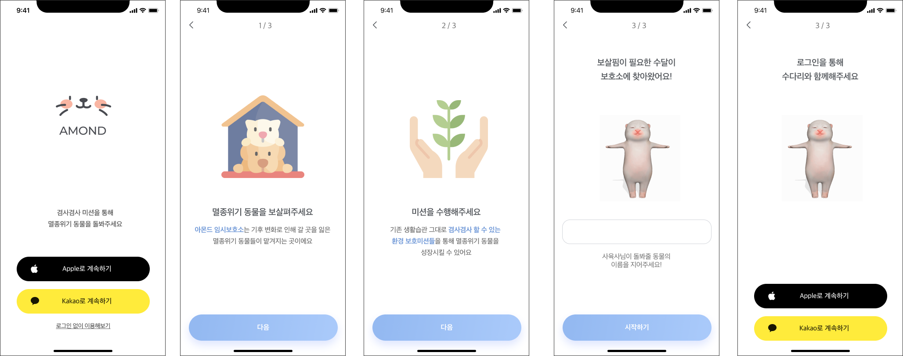
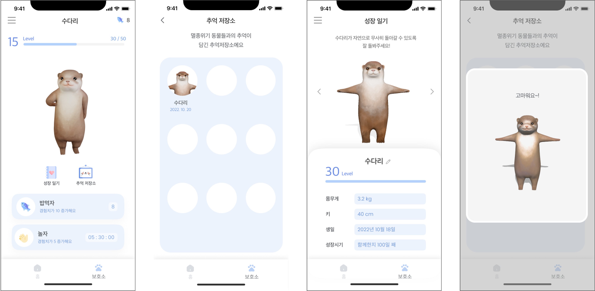
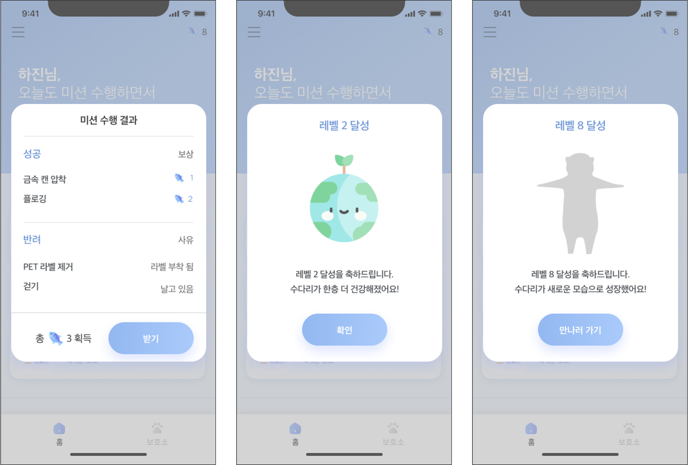
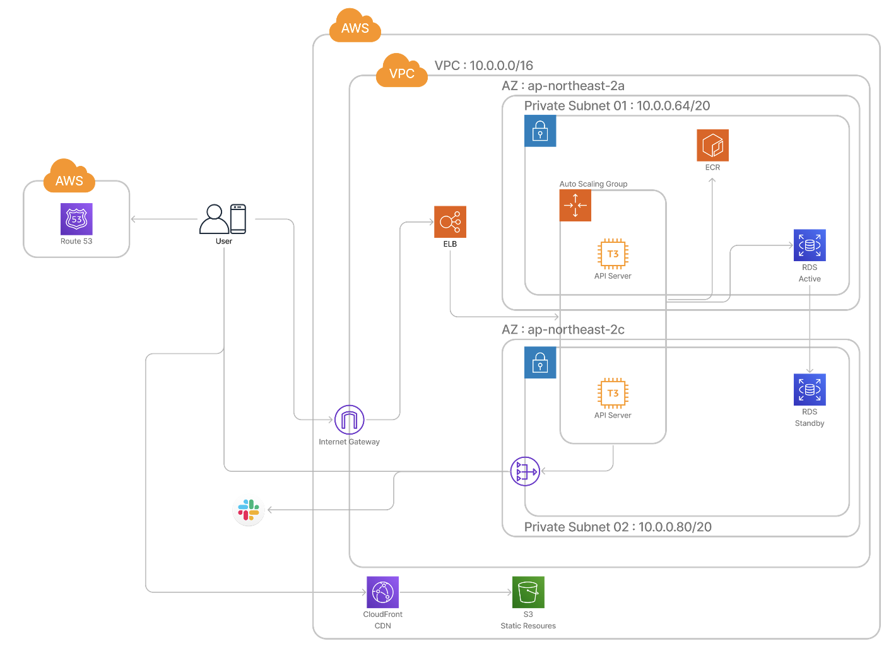
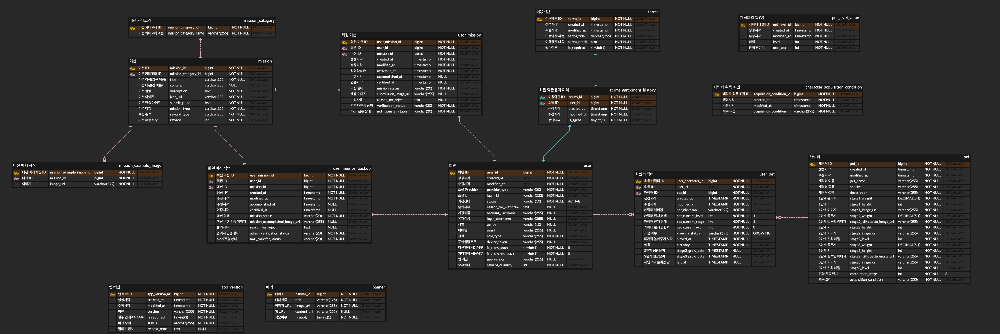
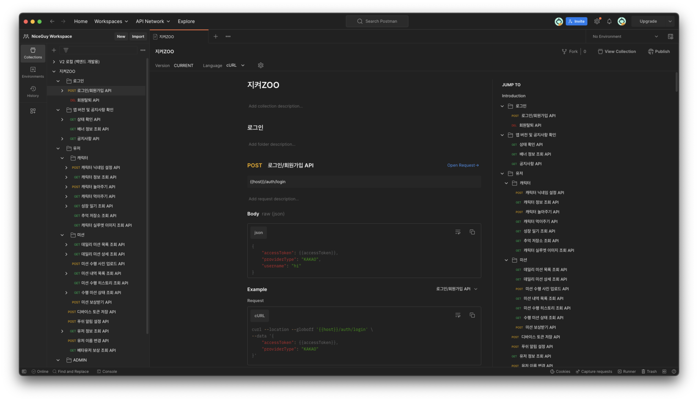
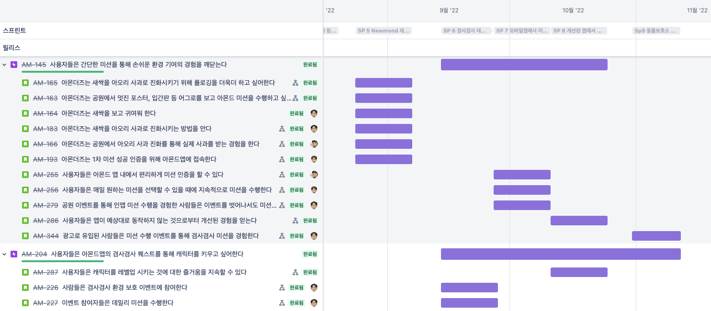

# 지켜ZOO Backend API Server

> 이 성과는 2022년도 과학기술정보통신부의 재원으로 정보통신기획평가원의 지원을 받아 수행된 연구임. 
> (IITP-2022-SW마에스트로과정)    This work was supported by the Institute of Information & Communications Technology Planning & Evaluation(IITP) grant funded by the Ministry of Science and ICT(MSIT) (IITP-2022-SW Maestro training course).

## 목차

- [1. 프로젝트 개요](#1-프로젝트-개요)
  - [1-1. 프로젝트 소개](#1-1-프로젝트-소개)
  - [1-2. 주요 기능](#1-2-주요-기능)
  - [1-3. 개발 환경](#1-3-개발-환경)
- [2. 개발 결과물](#2-개발-결과물)
  - [2-1. 시스템 아키텍처](#2-1-시스템-아키텍처)
  - [2-2. 데이터베이스 ERD](#2-2-데이터베이스-erd)
  - [2-3. API 문서화](#2-3-api-문서화)
  - [2-4. API 서버 CI/CD 파이프라인](#2-4-api-서버-cicd-파이프라인)
- [3. 수행 방법 및 프로젝트 관리](#3-수행-방법-및-프로젝트-관리)
  - [3-1. 개발 프로세스](#3-1-개발-프로세스)

## 1. 프로젝트 개요

### 1-1. 프로젝트 소개
환경 문제에 대한 관심은 있지만 많은 불편함을 감수하면서 환경 보호 하는 것이 어려운 사람들에게, 친환경 활동의 진입장벽을 낮춰주는 모바일 앱입니다.

일상 속에서 간편하게 수행할 수 있는 환경 친화적 행동을 제시하면서 `소소하게` 환경을 보호하도록 돕습니다.

### 1-2. 주요 기능

### 1-3. 개발 환경

- Front-end: `Flutter`, `Dart`, `GetX`
- Back-end: `Java`, `Spring Boot`, `Spring Security`, `JPA`, `Mysql`, `AWS`, `Docker`

## 2. 개발 결과물

### 2-1. 시스템 아키텍처

지켜ZOO의 AWS 기반 클라우드 아키텍처는 Multi-AZ를 통한 이중화와 Auto-Scaling을 지원하도록 설계하였습니다. 

### 2-2. 데이터베이스 ERD

### 2-3. API 문서화

### 2-4. API 서버 CI/CD 파이프라인

Agile 하게 작업한 API 서버를 배포하기 위해, Github Actions 를 통한 CI/CD pipeline 을 구축하였고, 
개발환경과 운영환경을 분리하면서 Docker compose 를 활용하여 컨테이너들을 관리하였습니다.

## 3. 수행 방법 및 프로젝트 관리

### 3-1. 개발 프로세스

MVP 를 빠르게 개발하고 유저의 피드백에 따라 민첩하게 반응하기 위해 Scrum 방식으로 개발을 진행했습니다.